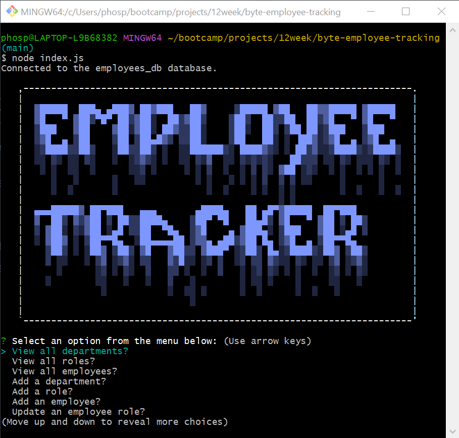

# Byte-Employee-Tracker

## Description

A command-line node.js application that allows the user to view, add, update, and delete employees, roles, and departments in a mysql database. Additionally it allows the user to view the total utilized budget of a department.

## Table of Contents

- [Description](#description)
- [Usage](#usage)
- [Link to video of node.js application](#link-to-video-of-node.js-application)
- [Screenshot](#screenshot)
- [Testing](#testing)
- [License](#license)
- [Questions](#questions)
- [Credits](#credits)

## Usage

To use this application, the user must first install the required dependencies by running the following command in the terminal:

```bash
npm i
```

Then the user must run the following command to start the application:

```bash
node index.js
```

## Link to video of node.js application

[Video of application in action](https://drive.google.com/file/d/1qhsgOx-Xocbte55WEcGl6aXDUw5k_Cx0/view)

## Screenshot



## Testing

I have not yet written any tests for this application.

## License


Mit License

## Questions

If you have any questions about the repo, open an issue or contact me directly at [phosphorescence3@hotmail.com](mailto:phosphorescence3@hotmail.com). You can find more of my work at [lesley-byte](https://github.com/lesley-byte) on github.

## Credits

I would like to thank my tutor, my classmates, and my instructor for their help and support.
